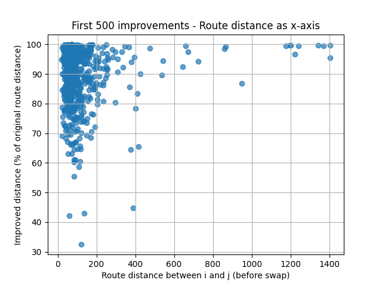
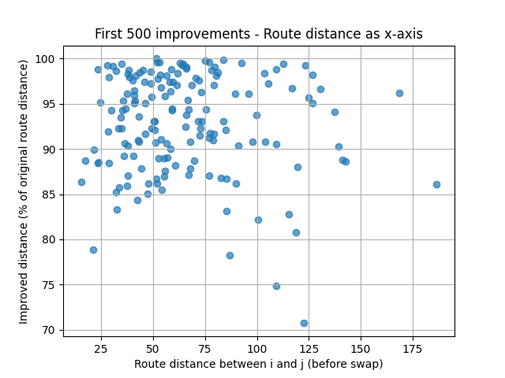
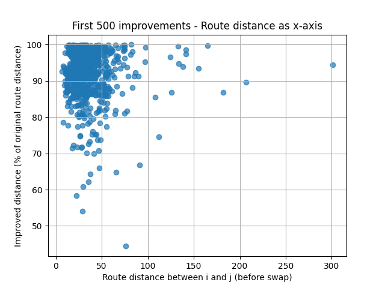

## STEP Week6 Documentation
### Author: Mimo Shirasaka

## Challenge 2
Week5 の巡回セールスマン問題 (TSP) のプログラムを改善して、Challenge 6 のベストスコア更新を目指す
(Challenge 6 には 40000 以下の答えが存在します)

### やったこと
#### 1. コードレビューした他のメンバーが、ILS を試していたので、その関数を少し自分のプログラム用に編集して試してみた。
結果：自分のコードでは、値としては改善しなかったが、元コードで出力がわかりやすいように工夫されていたので、実行すると何が起きているのかわかり、良かった。

他の人と組み合わせた実行結果（2opt の後に ILS）：
ILS finished. Final Best Distance: 20947.12


#### 2. エリアを４分割してから、greedy + 2opt する方法

プログラム： `solver_area2opt.py`

##### プログラムの内容
エリアを４分割
エリアごとに、greedy + 2opt で経路最適化
全ての順列パターンを試す（4! = 24通り）し、最短経路になる順序で４エリアを連結

結果：

Challenge 5
output          :   24123.07
sample/random   :  347392.97
sample/greedy   :   25331.84
sample/sa       :   21119.55

この解法だと、week5より長くなってしまった…。


#### 3. 2optの時にルートが改善したかどうかの判定を、全体ルートではなく、着目する２ノード間のみ計算するよう変更した
プログラム：
`solver_opt`

結果：
実行時間が格段と速くなった！（week5 の時は、input6 で2日くらいかかったが、今回は１時間くらいでおわった）

Challenge 6
output          :   42712.37
sample/random   : 1374393.14
sample/greedy   :   49892.05
sample/sa       :   44393.89

ここで、改善度合いを可視化して調べてみたところ、大きな改善が少ないことに気づいた。　



なんとか改善が大きいものを優先して計算したい！
ということで、下記３番に示すやり方を思いつき、試してみた。


#### 4. 2optを、改善度合いの大きさが大きいものを優先して計算するようにした
プログラム：
`solver_opt_week6.py`

##### プログラムの内容
準備：まずgreedyで経路を求める
2opt 1回目：改善度合いの大きさに関する閾値を設定し、2ノード間のswapをした結果、短くなった度合いが大きいもののみ、更新する
2opt 2回目：改善したものは全て、best_route として更新する

結果：
実行がとても速くなった！（１、2分で実行完了した。）

Challenge 6
output          :   41711.62
sample/random   : 1374393.14
sample/greedy   :   49892.05
sample/sa       :   44393.89




２段階で2optすることで、スコアも改善した。
また、プロットしてみた結果、改善度合いが大きいものが増えたことがわかった。

#### 5. 3では2段階だったが、それを１０段階に分けて、だんだん閾値を10ずつ緩めていった

Iteration 10: Tour length = 42712.37
Result has been saved to: output_6.csv


２段階の時の方が結果は良かった。

# Challenge 3
input_7.csv で試してみよう！

### やったこと
#### 1. Challenge 2 の、解法4で解いてみた。

結果：

Challenge 7
output          :   83156.14



#### 2. 閾値を１０段階に分けて、10回実行した

Iteration 1: Tour length = 95983.29
Iteration 2: Tour length = 95983.29
Iteration 3: Tour length = 95983.29
Iteration 4: Tour length = 95983.29
Improvement found: 52.0739 -> 26.0036 (cities 7648, 4022, 7557, 3536), shorted by: 49.94%
Iteration 5: Tour length = 95957.22
Improvement found: 21.3522 -> 12.0736 (cities 5219, 3602, 3786, 1874), shorted by: 56.54%
Improvement found: 43.2959 -> 23.9003 (cities 1895, 6016, 141, 6846), shorted by: 55.20%
Improvement found: 65.2878 -> 38.8338 (cities 1325, 7528, 3788, 5158), shorted by: 59.48%
Improvement found: 50.0950 -> 28.6836 (cities 1437, 1344, 3462, 2728), shorted by: 57.26%
...
Iteration 7: Tour length = 91581.71
...

結果：
Challenge 7
output          :   84190.72


実行方法：
```bash
python solver_area2opt.py input_0.csv
```

結果は、`output_0.csv` に保存されます。


